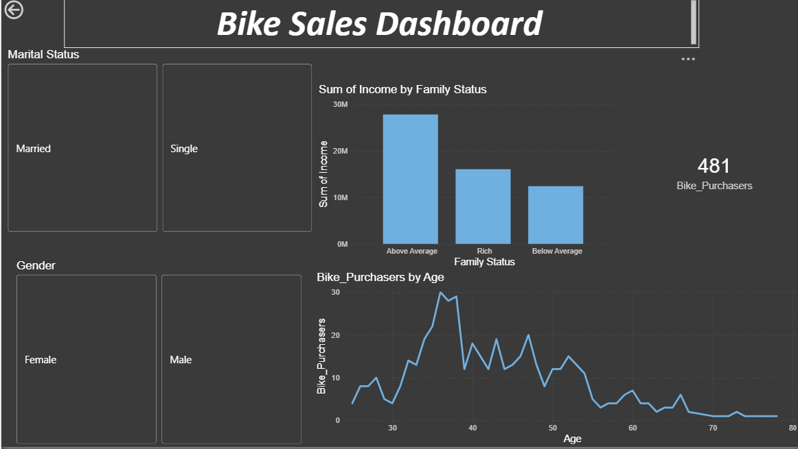
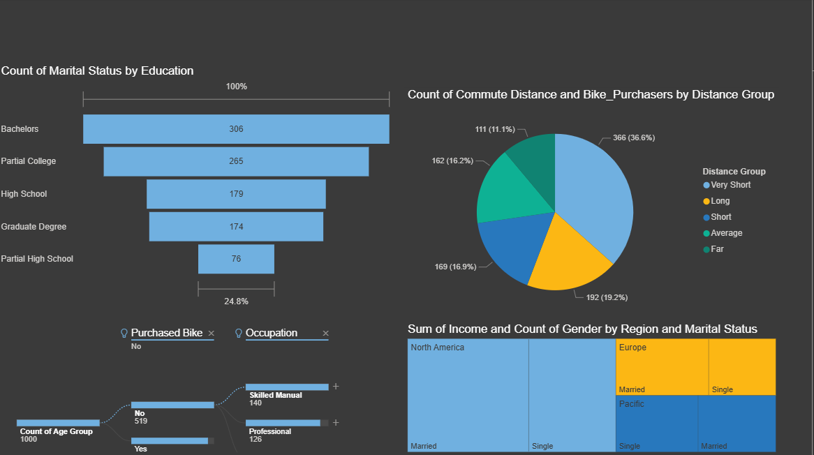

# Bike_Sales_Project

📊 Project Overview

This project analyzes bike sales data to understand customer demographics, income patterns, and purchasing behavior.

🛠 Tools Used

Excel (Data Cleaning)

Power BI (Dashboard & Visualization)

📈 Key Insights

Income impact on bike purchases
Age group analysis

Marital status & home ownership trends

Region-wise sales distribution

## Dashboard Preview 

